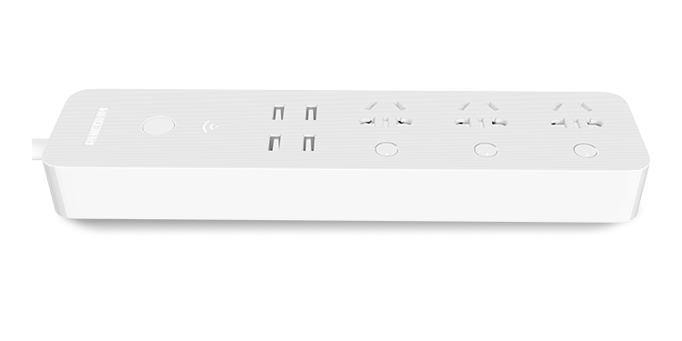
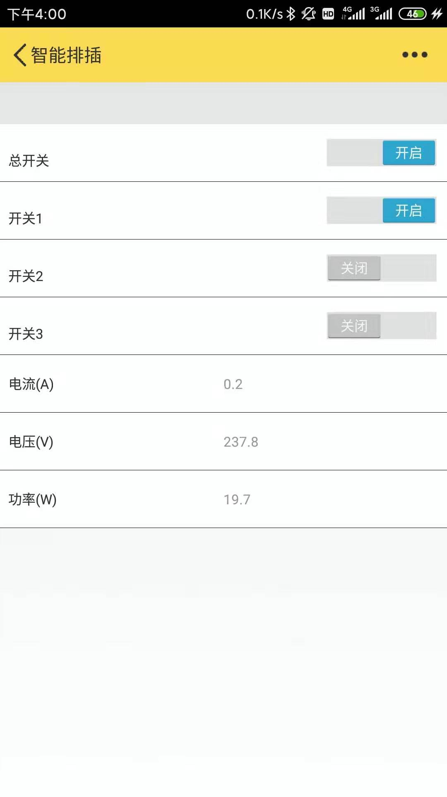
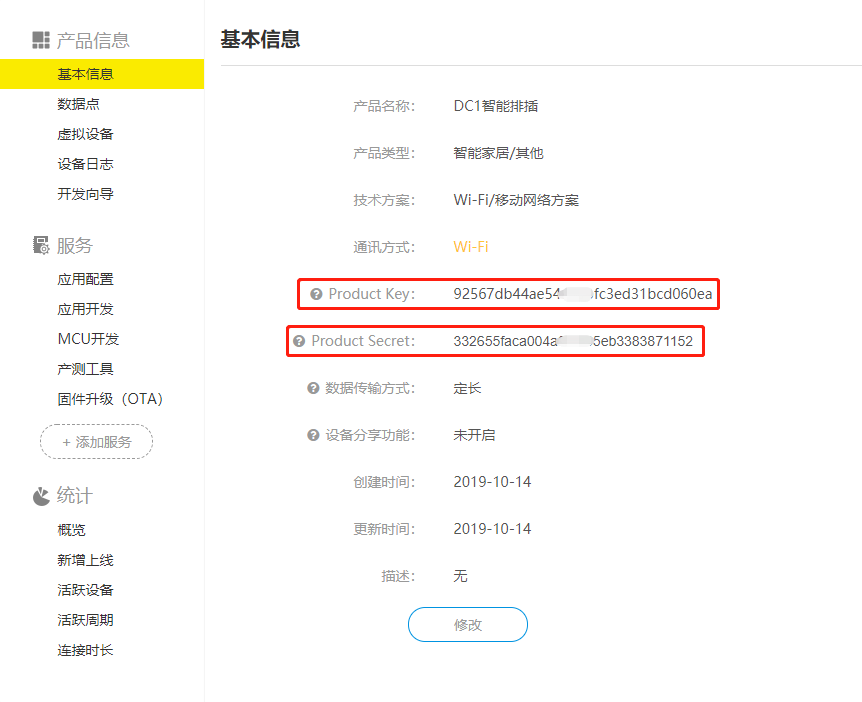
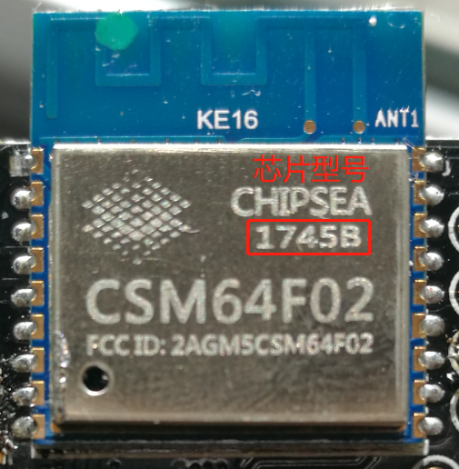

# Gizwits_DC1
## 使用机智云平台实现斐讯DC1排插的APP远程控制

斐讯DC1智能排插，由于某些原因斐讯公司的服务器已经关闭，官方app已经无法再使用。排插失去远程控制的功能，所以价格也沦为普通排插的价格。但是可以通过机智云的服务器实现APP的远程控制。

1. 低成本(40RMB)
2. APP远程控制
3. 可查看电压、电流、功率
4. 改造现成插座，简单，美观
5. 间接有了智能台灯、智能风扇......
   

 

### APP界面
 

### 使用方法
1. 在[机智云](https://dev.gizwits.com/zh-cn/developer/)创建产品
2. 导入数据点
3. clone 项目
4. 修改 gizwits_protocol.h 文件
    * `PRODUCT_KEY`改为机智云产品 Product Key
    * `PRODUCT_SECRET`改为机智云产品 Product Secret
    *  
5. 修改 Makefile 文件
    * 芯片型号带B为8Mbit  `SPI_SIZE_MAP?=2`
    * 芯片型号不带B为16Mbit  `SPI_SIZE_MAP?=5`
    *  
6. 拆解DC1排插取出控制板
7. [编译下载](https://wiki.ai-thinker.com/esp8266)
    * 使用USB转TTL下载
    * 下载前请先拉低IO0(按下白色按键)
    *  
8. 重新上电LED慢闪即固件刷入成功
9. 将控制板安装回插排中(请将后盖盖好再插上电源)
10. 长按总开关WIFI信号灯快闪进入配网模式
11. 使用机智云APP进行一键配网

### 使用说明
1. 任意开关打开都会触发总开关
2. USB的开关随总开关的状态
3. LOGO灯即是总开关和USB的状态
6. WIFI信号灯慢闪即正在连接WIFI
7. WIFI信号灯快闪即进入配网模式
8. WIFI信号灯常亮即成功连接WIFI 
7. 长按总开关进入配网模式，用于重新配网
8. 每次配网自动保存，可共存两个WIFI信息